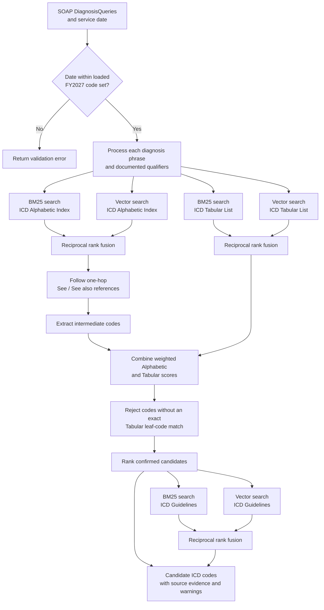
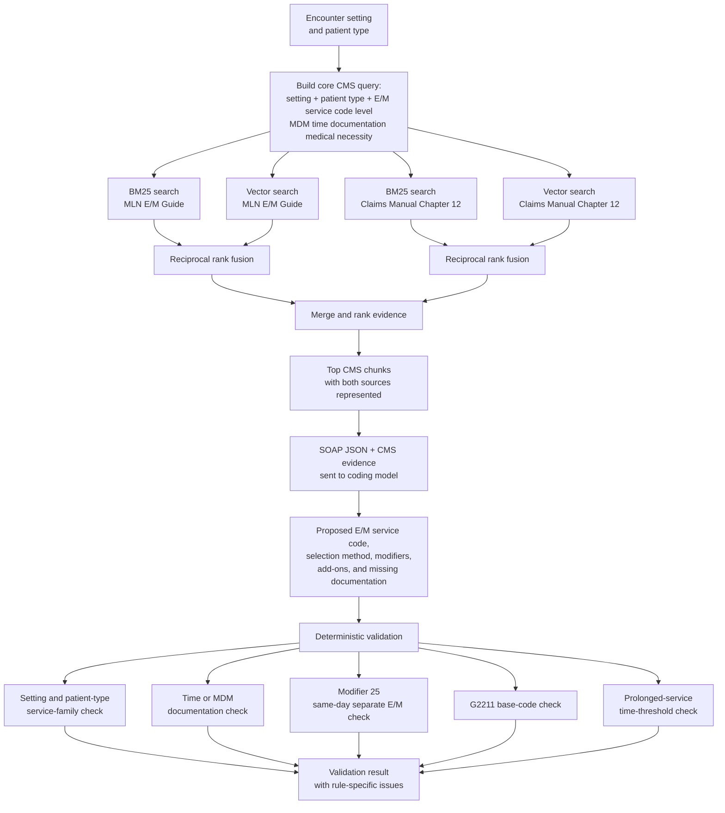
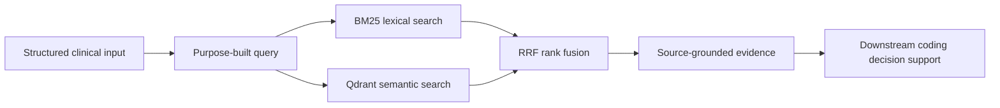

# Retrieval Flows

The application uses two independent hybrid retrieval processes. Both combine
local BM25 results with Qdrant vector results using reciprocal rank fusion
(RRF), but they serve different coding tasks.

## ICD-10-CM retrieval

`retrieve_icd.py` accepts the SOAP note's `DiagnosisQueries` and the date of
service. It searches the Alphabetic Index first, follows one-hop cross
references, confirms candidate codes against exact Tabular List leaf codes,
and retrieves relevant coding guidelines.

Output is supporting evidence and ranked candidates, not a final coding
decision. Each candidate includes Alphabetic and Tabular evidence, rank,
score, and documentation warnings. Guideline passages are returned separately
for downstream review or model context.

## CMS E/M retrieval

`retrieve_cms.py` accepts an encounter setting and patient type. It constructs
one core query and runs that same query against the MLN E/M Guide and Claims
Processing Manual Chapter 12.

The retrieval module supplies the evidence and deterministic validation. The
coding-model call shown between those stages is the downstream integration
boundary and is intentionally not tied to a specific LLM provider inside the
retriever.

## Shared retrieval pattern

BM25 recovers exact codes and terminology, while vector search recovers
semantically related language. RRF combines their ranks without comparing the
channels' incompatible raw scores.
