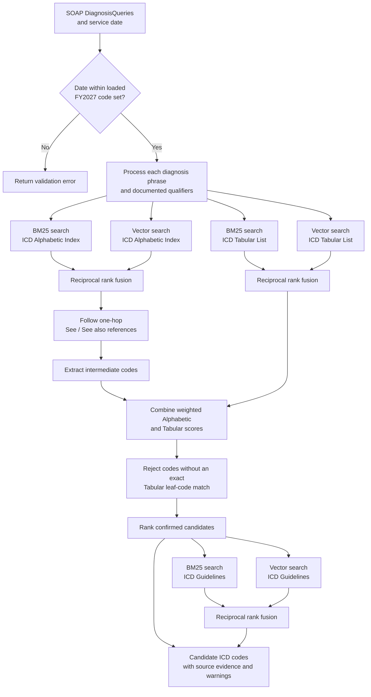
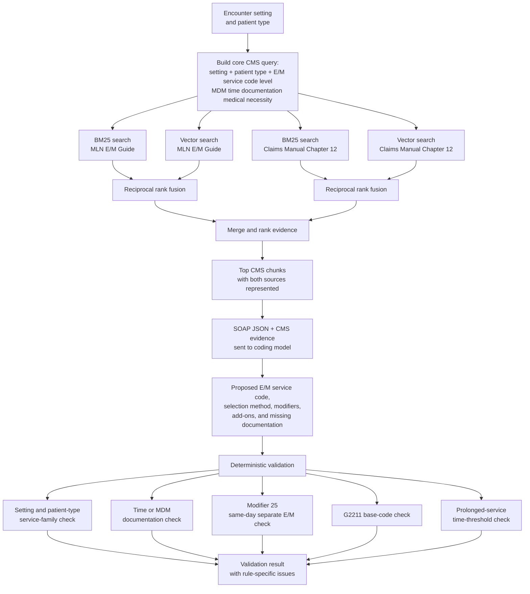
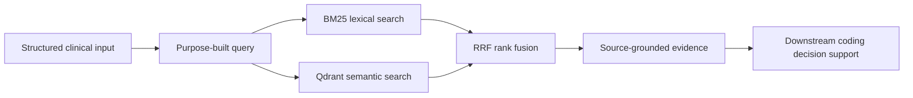

# Retirieval 
The ICD-10-CM codes are retrieved using three documents:
- ICD Alphabetic Index: 1364 pages of codes in Alphabetic order
- ICD Tabular Index: 2075 pages of the same codes in Tabular order
- ICD Official Coding Guidelines: 100 pages of coding guidelines

The Alphabetic Index is used to find the codes, the Tabular Index is used to verify them, while the Coding guidelines are used for code reporting conventions and sequencing rules. 

The CMS E/M guidelines are retrieved from two documents:
- MLN E/M booklet
- Medicare CLM Manual Manual Chapter 12

The MLN E/M services booklet is used to determine the appropriate E/M service family and level while the Medicare Claims Processing Manual Chapter 12 is used for applying billing and reporting rules for the selected service.

Due to the large size of these documents and requirement for correctness, a retrieval system was used.

# Retrieval Flows

The application uses two independent hybrid retrieval processes. Both combine
local BM25 results with Qdrant vector results using reciprocal rank fusion
(RRF), but they serve different coding tasks.

## Why Hybrid search over vector-RAG alone?

Our search contains two parts: Embedded vector similarity search and BM25 Keyword search. These two are scored and compared with RRF (Reciprocal Ranekd Fusion). 

While vector search is great for comparing meanings, it performs poorly when exact keyword matches are requried. In our case, we are dealing with a plethora of medical terms and medical codes. BM25 works excellently to mathc these terms but lacks when a synonym is used in the query.

In Hybrid search, both of these methods contribute to ranking. This way, when one search misses a code, the other can still put it in the ranking. 

## ICD-10-CM retrieval

`retrieve_icd.py` accepts the SOAP note's `DiagnosisQueries` and the date of
service. First, it conducts a hybrid search over the ICD Alphabetic Index. It then checks all references (See, see also) mentioned with the returned ICD codes. Next, another hybrid search is conducted on the Tabular Index. All of these search candidates from both searches are scored with weights:  alphabetic weight * alphabetic score + tabular weight * tabular score
The codes that are not found in the tabular index are skipped. The returned candidates are then checked for special cases that require additional guidelines. At the end, these candidates are returned with there scores, metadata and guidelines.  

Output is supporting evidence and ranked candidates, not a final coding
decision. Each candidate includes Alphabetic and Tabular evidence, rank,
score, and documentation warnings. Guideline passages are returned separately
for downstream review or model context.

## CMS E/M retrieval

`retrieve_cms.py` accepts an encounter setting and patient type. It constructs
one core query and runs that same query against the MLN E/M Guide and Claims
Processing Manual Chapter 12. 

These two hybrid searches returns candidates with scores, which are used to rank these candidates again with RRF. 
The candidates are also checked againts deterministic rules that may require additional information. Candidates are returned as CMS issues that addresses a specific rule, notes, and metadata.  

The retrieval module supplies the evidence and deterministic validation. The
coding-model call shown between those stages is the downstream integration
boundary and is intentionally not tied to a specific LLM provider inside the
retriever.

## Shared retrieval pattern

BM25 recovers exact codes and terminology, while vector search recovers
semantically related language. RRF combines their ranks without comparing the
channels' incompatible raw scores.
